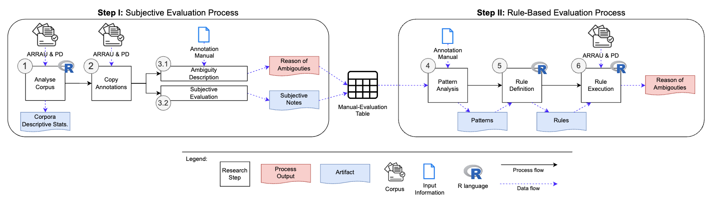

# Anaphora and Ambiguity - An Analysis of Disagreement in Anaphoric Annotation

This repository is a companion page for the Master's thesis, containing the scripts to replicate and reproduce the study and its results.

The study was carried out by Lukas Beiske, University of Konstanz, Department of Linguistics, 2024.

## Quick Links

* [Rule Based Framework (R)](scripts/RuleBasedFramework.Rmd)
* [Descriptive Statistics Script with visualisations (HTML)](scripts/DescriptiveStatisticsVisual.html)

## Study Design



## Note

In order to run the R scripts and perform the rule based process, the necessary Corpora (i.e., ARRAU and PD) need to be loaded. To do so, customize the paths as in the example below:

```r
#path to input folders with XML files
folders_xml <- c("../data/ARRAU/RST",
                 "../data/ARRAU/Trains_91",
                 "../data/PD/gutenberg",
                 "../data/PD/wiki")
```

## Repository Structure
This repository is organised as follows:

```
AnaphoricAmbiguity_MAThesis
    .
    |
    |--- documentation/
        |
        |--- study-design.pdf
        |--- study-design.png
                The used methodlogy in the theis.
    |--- scripts/
        |
        |--- RuleBasedFramework.Rmd
                Main script for the rule based categorisation process in R (markdown).
        |--- DescriptiveStatistics.Rmd
                Script for executing the descriptive statistics in addition to the rule based categorisation in R (markdown).
        |--- DescriptiveStatisticsVisual.html
                Output for the descriptive statistics in HTML including the visualisations. 
    |--- heatmaps/
        |
        |--- heatmaps_category_values/*
                Heatmaps describing the ambiguities in category values.
        |
        |--- heatmaps_generic_values/*
                Heatmaps describing the ambiguities in generic values.
                    
```
